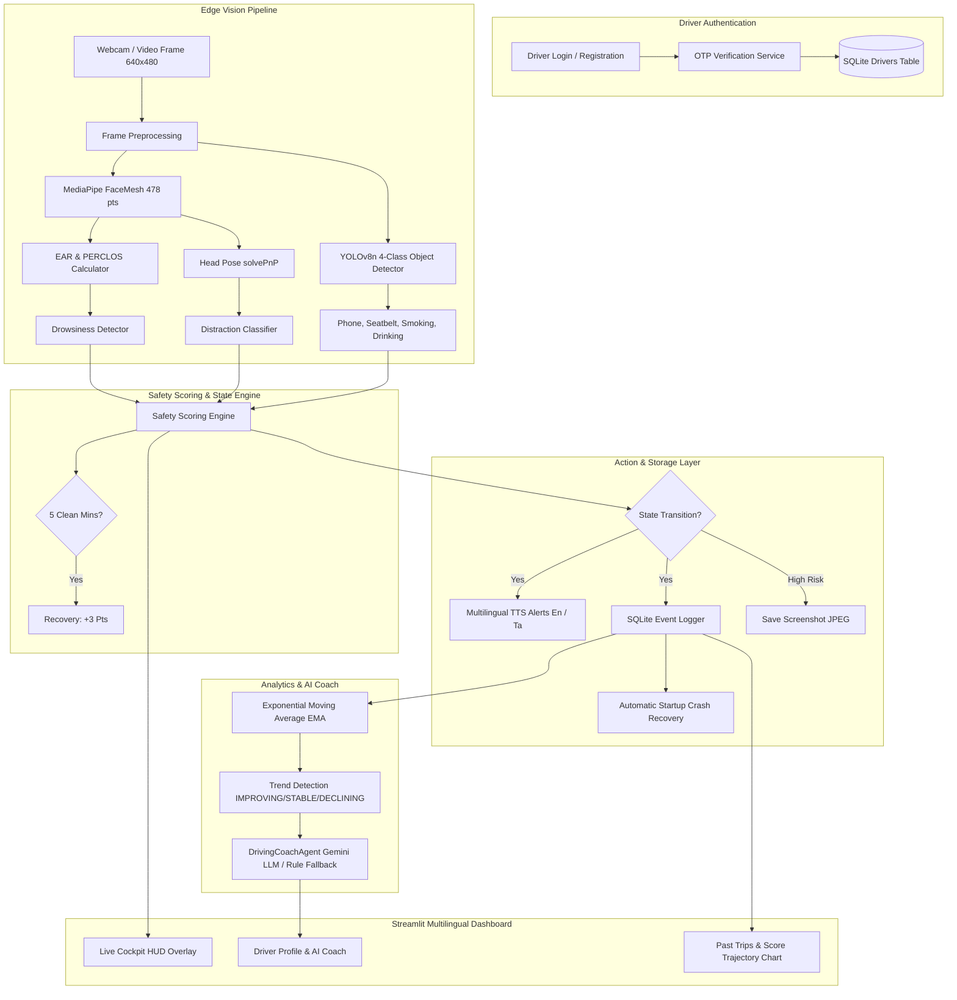

# Edge-AI Driver Monitoring System (DMS)

> **"Monitors the DRIVER, not the vehicle."**  
> An edge-first, real-time computer vision system built to detect drowsiness, distraction, phone usage, seatbelt compliance, smoking, and drinking with zero cloud latency.

---

## 📌 Project Overview

Traditional Advanced Driver Assistance Systems (ADAS) focus externally on lanes, obstacles, and preceding vehicles. The **Edge-AI Driver Monitoring System** focuses inward on the driver's physiological and behavioral state.

Built strictly on edge hardware, the system executes real-time vision pipelines locally without sending video streams to cloud servers, ensuring **data privacy**, **ultra-low latency**, and **consistent offline operation**.

### Key System Capabilities
- 🔐 **Driver Authentication & Gating**: Secure mobile OTP sign-in/sign-up with in-memory challenge verification and per-driver session isolation.
- 👁️ **Drowsiness & Microsleep Detection**: Eye Aspect Ratio (EAR) + 60-second temporal sliding-window PERCLOS metric via MediaPipe FaceMesh (478 landmarks with iris refinement).
- 🧭 **Head Pose & Distraction Estimation**: 3D canonical head pose estimation (Yaw, Pitch, Roll) using `cv2.solvePnP` to classify gaze direction (`FORWARD`, `LEFT`, `RIGHT`, `DOWN`).
- 📱 **4-Class Behavior Detection**: Ultralytics YOLOv8n (Nano) for detecting mobile phone usage, seatbelt status, smoking, and drinking with 15-frame temporal debouncing.
- 🧮 **Safety Scoring Engine with Recovery**: Dynamic score starting at `100` (floored at `0`) with graded risk bands (`SAFE`, `LOW RISK`, `MEDIUM RISK`, `HIGH RISK`), transition-based debounced deductions, and a **continuous steady driving recovery mechanism** (`+3` points every 5 clean minutes).
- 🗣️ **Multilingual Offline Voice Alerts**: Multithreaded, rate-limited audio warnings supporting **English** (`pyttsx3` / SAPI5) and **Tamil** (`eSpeak-NG` offline engine) with zero cloud round-trips.
- 🤖 **AI Driving Coach Agent**: Computes an exponentially-weighted Overall Risk Score ($\lambda = 0.85$), identifies performance trends (`IMPROVING ↗️`, `STABLE ➡️`, `DECLINING ↘️`), and generates personalized coaching notes (via optional Gemini LLM with zero-crash rule template fallback).
- 🗄️ **Crash-Resilient SQLite Storage**: Automatic startup recovery for unclosed/crashed sessions, structured violation logging, violation screenshot captures, and CSV export.
- 📊 **Multilingual Interactive Dashboard**: Streamlit cockpit featuring Live Camera Stream, Driver Profile & AI Coach, and a dedicated **History & Score Progression Trajectory** viewer.

---

## 🏗️ Architecture & Pipeline Flow



### ASCII Pipeline Architecture
```
+----------------------------------------------------------------------------------------------------+
|                                  EDGE-AI DRIVER MONITOR PIPELINE                                   |
+----------------------------------------------------------------------------------------------------+
|  1. Driver Auth Gate (Mobile OTP Verification -> Scoped driver_id)                                 |
|                                                                                                    |
|  2. Camera Frame (640x480 Edge Video Feed)                                                         |
|       |                                                                                            |
|       +---> MediaPipe FaceMesh (478 pts) ---> EAR / PERCLOS (Drowsiness)                           |
|       |                                  ---> solvePnP Pose (Distraction)                          |
|       |                                                                                            |
|       +---> YOLOv8n Nano (4-Class) --------> Phone (-15), Seatbelt (-20), Smoking (-15), Drink (-15)|
|                                                                                                    |
|  3. Scoring Engine (100 -> 0) + Continuous Recovery (+3 pts / 5 min clean driving)                 |
|       |                                                                                            |
|  4. Action & Storage Layer                                                                         |
|       +---> Multilingual Voice Alerts (pyttsx3 for English, eSpeak-NG for Tamil)                   |
|       +---> SQLite Event Storage & Crash Recovery (driver_monitor.db)                              |
|       +---> DrivingCoachAgent (Exponential Moving Average + Trend + Gemini LLM / Rule Fallback)    |
|       +---> Streamlit Dashboard (Live Cockpit | Driver Profile | History & Score Trajectory)        |
+----------------------------------------------------------------------------------------------------+
```

---

## 📁 Repository Structure

```
edge-ai-driver-monitor/
├── src/
│   ├── __init__.py
│   ├── config.py              # Central configuration (thresholds, weights, paths)
│   ├── smoke_test.py          # Environment verification test
│   ├── auth/                  # Driver Authentication & Profile Management
│   │   ├── __init__.py
│   │   ├── models.py          # Driver dataclass and schema definitions
│   │   ├── otp_service.py     # OTPProvider abstraction & DevConsole simulation
│   │   └── auth_db.py         # SQLite drivers table CRUD operations
│   ├── vision/
│   │   ├── __init__.py
│   │   ├── face_mesh.py        # MediaPipe FaceMesh wrapper (478 3D landmarks)
│   │   ├── drowsiness.py       # EAR calculation + rolling window + PERCLOS
│   │   ├── distraction.py      # Head pose (Yaw/Pitch/Roll) via solvePnP
│   │   └── object_detector.py  # 4-class YOLOv8 wrapper + 15-frame debouncing
│   ├── scoring/
│   │   ├── __init__.py
│   │   └── safety_score.py     # Scoring engine with recovery (+3 pts / 5 mins)
│   ├── alerts/
│   │   ├── __init__.py
│   │   ├── phrases.py          # Bilingual phrase dictionaries (English & Tamil)
│   │   └── voice_alert.py      # Offline multi-backend TTS (pyttsx3 & eSpeak-NG)
│   ├── agent/
│   │   ├── __init__.py
│   │   └── driving_coach.py    # DrivingCoachAgent (EMA, Trend, Gemini LLM fallback)
│   ├── storage/
│   │   ├── __init__.py
│   │   ├── db.py               # SQLite schema, crash recovery, and filtered history
│   │   ├── analytics.py        # Driver risk scoring integration
│   │   └── event_logger.py     # Structured event logger + screenshots + CSV export
│   └── pipeline.py             # End-to-end DriverMonitorSession orchestrator
├── dashboard/
│   ├── app.py                  # Live cockpit & OTP authentication entry point
│   └── pages/
│       ├── 1_Profile.py        # Driver profile, EMA risk card, AI coaching note
│       └── 2_History.py        # Multi-session history filters & score trajectory chart
├── scripts/
│   ├── prepare_dataset.py      # 4-class dataset standardizer & 80/10/10 split
│   └── train_yolo.py           # 4-class YOLOv8n fine-tuning & speed benchmarking
├── models/                     # Trained YOLO weights & benchmark JSON files
├── data/                       # Dataset storage directory (gitignored)
├── tests/
│   ├── __init__.py
│   ├── test_auth.py            # Authentication, OTP, and driver CRUD tests
│   ├── test_scoring.py         # Safety scoring and recovery interval tests
│   ├── test_bilingual_alerts.py# English & Tamil TTS alert phrase tests
│   ├── test_driving_coach.py   # DrivingCoachAgent EMA weighting & trend tests
│   ├── test_session_persistence.py # Crash recovery & history filter tests
│   ├── test_storage.py         # SQLite database and logger unit tests
│   ├── test_voice_alert.py     # Non-blocking voice alert verification test
│   ├── test_pipeline_live.py   # Full pipeline live camera debug test
│   └── demo_walkthrough.py     # Scripted 4-stage presentation demo test
├── requirements.txt            # Pinned project dependencies
├── .gitignore
└── README.md
```

---

## ⚡ Performance Benchmarks (Measured on Edge CPU)

The system was benchmarked on physical host CPU hardware (`scripts/train_yolo.py --benchmark-only`):

| Metric | Measured Value | Target / Notes |
| :--- | :--- | :--- |
| **Processor** | AMD64 Family 25 (Windows 11) | Host CPU (Edge Benchmark) |
| **YOLO Architecture** | YOLOv8n (Nano) | 3.2M parameters |
| **PyTorch Execution Device** | `CPU` (`torch 2.13.0+cpu`) | No cloud/GPU dependency |
| **Mean Inference Latency** | **`184.02 ms`** | 640x640 resolution |
| **Median Latency** | **`148.49 ms`** | Consistent per-frame timing |
| **P95 Latency** | **`395.27 ms`** | Peak frame latency |
| **Inference Throughput** | **`5.43 FPS`** | Raw edge CPU object detection |
| **Voice Alert Enqueue Latency** | **`< 0.50 ms`** | Fully non-blocking background queue |

---

## 📊 Safety Scoring Rules & Risk Bands

| Violation Type | Deduction | Condition | English Alert Phrase | Tamil Alert Phrase |
| :--- | :---: | :--- | :--- | :--- |
| **Drowsiness** | `-20 pts` | Sustained low EAR (<0.21) for >1.5s | *"Warning! Driver is drowsy."* | *"எச்சரிக்கை! ஓட்டுநர் சோர்வாக உள்ளார்."* |
| **Distraction** | `-10 pts` | Sustained head pose deviation (>25° yaw, >20° pitch) for >1.5s | *"Please keep your eyes on the road."* | *"சாலையில் கவனம் செலுத்துங்கள்."* |
| **Phone Usage** | `-15 pts` | Mobile phone detected in driver field of view | *"Warning! Mobile phone detected."* | *"எச்சரிக்கை! கைபேசி பயன்பாடு கண்டறியப்பட்டது."* |
| **No Seatbelt** | `-20 pts` | Driver unbuckled / seatbelt absent | *"Please fasten your seatbelt."* | *"இருக்கை பட்டையை அணியுங்கள்."* |
| **Smoking** | `-15 pts` | Cigarette/vape detected near mouth or hand | *"Warning! Smoking detected."* | *"எச்சரிக்கை! புகைபிடிப்பது கண்டறியப்பட்டது."* |
| **Drinking** | `-15 pts` | Bottle/cup raised to mouth while driving | *"Warning! Drinking while driving."* | *"எச்சரிக்கை! வாகனம் ஓட்டும்போது குடிப்பது கண்டறியப்பட்டது."* |
| **Recovery** | `+3 pts` | Every 5 continuous minutes of zero violations (caps at 100) | *"+3 — steady driving!"* | *"+3 — சீரான வாகனம் ஓட்டுதல்!"* |

### Risk Level Bands
- 🟢 **90 – 100**: `SAFE`
- 🔵 **70 – 89**: `LOW RISK`
- 🟠 **40 – 69**: `MEDIUM RISK`
- 🔴 **0 – 39**: `HIGH RISK`

---

## 🚀 Quickstart & Setup Instructions

### 1. Environment Setup
```bash
# Clone or navigate to repository
cd edge-ai-driver-monitor

# Create virtual environment
python -m venv .venv

# Activate virtual environment
# Windows (PowerShell):
.venv\Scripts\Activate.ps1
# Linux/macOS:
source .venv/bin/activate

# Install dependencies
pip install -r requirements.txt
```

### 2. Verify Installation (Smoke Test)
```bash
python -m src.smoke_test
```

---

## 🖥️ How to Run & Feature Configuration

### 1. Launch the Interactive Streamlit Dashboard
```bash
streamlit run dashboard/app.py
```
- **Authentication Gating**: Opens directly into the Sign In / Sign Up portal.
- **OTP Dev-Mode Simulation**: During local development, the generated 6-digit OTP is automatically printed to the terminal console and shown in the UI simulation banner for easy 1-click testing.

### 2. Offline Bilingual Voice Alerts Setup
- **English**: Uses the built-in OS speech synthesizer via `pyttsx3` (e.g., Windows SAPI5).
- **Tamil**: Uses the standalone offline `eSpeak-NG` speech synthesizer with language tag `ta` (zero cloud calls, fully private and offline).

### 3. Optional AI Driving Coach API Key
To enable generative LLM personalized driving coaching notes:
```bash
# Windows PowerShell
$env:GEMINI_API_KEY="your_google_gemini_api_key_here"

# Linux / macOS
export GEMINI_API_KEY="your_google_gemini_api_key_here"
```
*(If no API key is set, the system automatically falls back to an offline rule-based template with zero downtime).*

### 4. 4-Class Dataset Preparation & Model Training
```bash
# 1. Standardize and split raw datasets (mobile_phone, seatbelt, smoking, drinking)
python scripts/prepare_dataset.py --kaggle-dir /path/to/kaggle --roboflow-dir /path/to/roboflow --smoking-dir /path/to/smoking --drinking-dir /path/to/drinking

# 2. Fine-tune YOLOv8n and benchmark
python scripts/train_yolo.py --epochs 50 --batch 16
```

### 5. Run Full Test Suites (53 Automated Tests)
```bash
# Run all unit tests repository-wide
python -m unittest discover -s tests

# Run individual test suites
python -m unittest tests/test_auth.py
python -m unittest tests/test_scoring.py
python -m unittest tests/test_bilingual_alerts.py
python -m unittest tests/test_driving_coach.py
python -m unittest tests/test_session_persistence.py
```

---

## 👥 Team
**Project**: Edge-AI Driver Monitoring System  
**Team**: Storm breakerz  
**Authors**: Kishore Kumar S, Gokul N  
**Institution**: Coimbatore Institute of Technology (CIT CSE)
